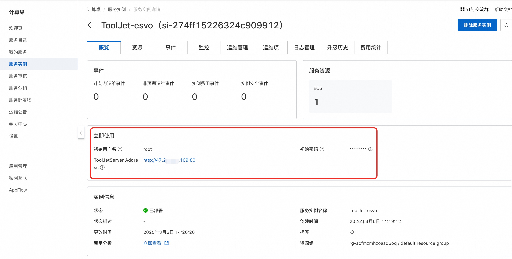

<h1>ILLA Community Edition Rapid Deployment </h1>

<h2> Overview </h2>

 Alibaba Cloud Computing Nest provides a complete foundation for the integrated delivery of software and resources, helping service providers and developers improve their service capabilities and reduce operating costs. Compute Nest already supports rapid deployment of ILLA Community Edition. 

<h2> Deployment process </h2>

<ol>
<li>
 visit the computing nest ILLA community version <a href = "https://computenest.console.aliyun.com/service/instance/create/default?type=user&ServiceName=ILLA社区版"> deployment link </a> and fill in the deployment parameters as prompted:
</li>
<li>
 after the parameters are filled in, you can see the corresponding inquiry details. after confirming the parameters, click <strong> next: confirm the order </strong>. 
</li>
<li>
 Confirm that the order is complete and agree to the service agreement and click <strong> Create Now </strong> to enter the deployment phase. 
</li>
<li>
 After the deployment is completed, you can start using the service. Enter the service instance details and click the service address.

</li>
<li>
 The ILLA service is available after the load is complete.

</li>
</ol>

<h2> Using Help </h2>

 Refer to <a href = "https://docs.illacloud.com/">ILLA official documentation </a> for more usage. 

