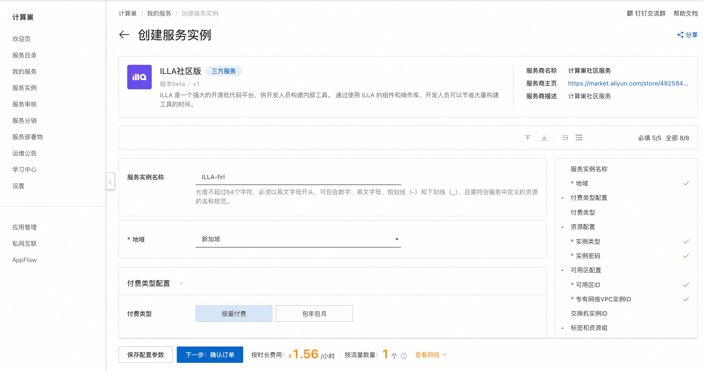
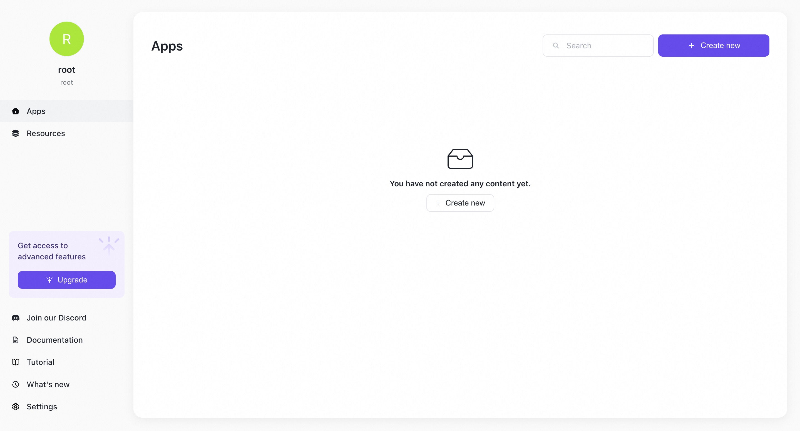

## 概述

阿里云计算巢提供了软件与资源的一体化交付的完善基础能力，助力服务商、开发者的提升服务能力和降低运营成本。计算巢已经支持快速部署 ILLA 社区版。

## 部署流程

1. 访问计算巢ILLA社区版[部署链接](https://computenest.console.aliyun.com/service/instance/create/default?type=user&ServiceName=ILLA%E7%A4%BE%E5%8C%BA%E7%89%88)，按提示填写部署参数：
   

2. 参数填写完成后可以看到对应询价明细，确认参数后点击**下一步：确认订单**。

3. 确认订单完成后同意服务协议并点击**立即创建**进入部署阶段。

4. 等待部署完成后就可以开始使用服务，进入服务实例详情点击服务地址。
   

5. 加载完成后即可使用ILLA服务。
   

## 使用帮助
更多用法请参考[ILLA官方文档](https://docs.illacloud.com/)。